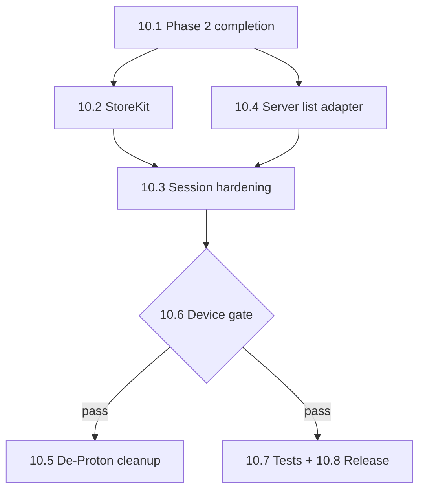

# Diode VPN Backend Port Plan (iOS / macOS)

This document is the implementation plan for replacing the Proton VPN backend in this repository with the **Diode VPN backend** (TicketV2 + WebSocket JSON-RPC + WireGuard exit nodes). It synthesizes:

- [diode-vpn-client-protocol-spec.md](./diode-vpn-client-protocol-spec.md) — wire protocol, crypto, session lifecycle
- [REFACTORING_GUIDE.md](./REFACTORING_GUIDE.md) — where Proton-specific VPN, billing, login, and secrets live today
- The reference Android client at **`/Users/dominicletz/projects/diode/diode_vpn_android`**

**Goal:** Keep the **Proton VPN UI 100% unchanged** — all screens, navigation, layouts, strings, assets, and user flows stay as they are today. Replace **only the backend**: server discovery, authentication, billing entitlement, RPC session, and WireGuard tunnel bring-up use the Diode VPN protocol (matching Android reference **backend** behavior).

**UI policy (permanent):** This is a **backend swap**, not a product redesign. Do not replace Proton screens with Android-style UI, do not rebrand visuals, and do not remove Proton feature surfaces from the UI. Backend work adapts data into existing Proton view models and connection hooks so the UI continues to behave the same from the user's perspective. See [§9.15](#915-ui-strategy-permanent).

**Non-goals:** Any UI/UX change, tvOS Diode backend parity, Proton Local Agent server-side features (NetShield enforcement, split tunneling via Local Agent), IKEv2/Plutonium paths, Proton account OAuth as the connect gate, and Proton web billing APIs.

**Status:** Phases 0–2 core and partial 3–4 are [implemented](./DIODE_VPN_PORT_STATUS.md). Remaining execution detail is in [§10](#10-remaining-work--execution-guide). Design decisions: [§9](#9-design-decisions-grill-session) (+ ongoing grill in §10.8).

### Progress at a glance

| Phase | Status | Blocker for next |
|-------|--------|------------------|
| 0 Baseline build | Not verified in CI | `protoncore` submodule access |
| 1 Crypto / TicketV2 | **Done** | — |
| 2 Network / RPC | **Mostly done** | GRDB cache, geo persist, TLS, integration test |
| 3 Entitlement | **Partial** | StoreKit service; login bypass |
| 4 Connection | **Partial** | Preflight, ticket refresh, reconnect, connection state |
| 5 UI adapter | **Not started** | §10.5 — server list injection point |
| 6 De-Proton | Not started | Phases 4–5 stable on device |
| 7 Tests | **Partial** (10 unit tests) | Integration + coordinator tests |
| 8 Release | Not started | `DIODE_BACKEND` schemes + device QA |

---

## 1. Reference implementation (Android)

Use the Android repo as the **source of truth for backend behavior** (protocol, crypto, RPC, tickets, tunnel config). It is **not** a UI reference — all user-facing surfaces remain Proton's. When in doubt, read the Kotlin file listed below before implementing the Swift equivalent.

| Topic | Android path |
|-------|----------------|
| Endpoints & constants | `app/src/main/kotlin/io/diode/vpn/network/NetworkConfig.kt` |
| Console fleet registration | `app/src/main/kotlin/io/diode/vpn/network/DiodeConsoleFleetRegistrar.kt` |
| App startup (fleet register, WG prewarm) | `app/src/main/kotlin/io/diode/vpn/DiodeVpnApplication.kt` |
| WebSocket JSON-RPC client | `app/src/main/kotlin/io/diode/vpn/network/DiodeRpcClient.kt` |
| Node list fetch & parse | `app/src/main/kotlin/io/diode/vpn/network/DiodeNetworkApi.kt`, `VpnNode.kt` |
| Server list cache | `app/src/main/kotlin/io/diode/vpn/network/ServerListRepository.kt`, `ServerDatabase.kt` |
| TicketV2 build/sign/RLP | `app/src/main/kotlin/io/diode/vpn/ticket/TicketV2.kt`, `TicketCommitment.kt` |
| RLP encoding | `app/src/main/kotlin/io/diode/vpn/crypto/DiodeRlp.kt` |
| Device signing key (Keychain equiv.) | `app/src/main/kotlin/io/diode/vpn/crypto/DeviceKeyStore.kt` |
| Connect orchestration | `app/src/main/kotlin/io/diode/vpn/ui/ServerListViewModel.kt` |
| WireGuard config | `app/src/main/kotlin/io/diode/vpn/vpn/WireGuardConfigBuilder.kt` |
| Tunnel lifecycle | `app/src/main/kotlin/io/diode/vpn/vpn/DiodeTunnelManager.kt`, `DiodeVpnService.kt` |
| Subscription gating | `app/src/main/kotlin/io/diode/vpn/billing/`, `SubscriptionManager.kt` |
| Integration tests | `app/src/test/java/io/diode/vpn/network/DiodeRpcLocalIntegrationTest.kt`, `WireGuardTunnelIntegrationTest.kt` |
| Ticket crypto self-test | `app/src/test/java/io/diode/vpn/ticket/TicketV2SignatureSelfTest.kt` |

Supporting Android docs:

| Doc | Path |
|-----|------|
| Architecture | `docs/architecture.md` |
| Protocol notes | `docs/protocol.md` |
| Subscription & tickets | `docs/subscription-and-tickets.md` |
| Dev setup & JVM integration test | `docs/setup.md` |
| Lite node deployment | `docs/lite-node-deployment.md` |

---

## 2. Diode Console API key (fleet membership)

Production Diode VPN clients must register each install’s **TicketV2 signing address** with Diode Console so the on-chain fleet contract recognizes the device. The protocol spec describes this in §13; the Android app implements it at startup via `fleet.member.add`.

### 2.1 Values (from Android `NetworkConfig.kt`)

| Constant | Value | Purpose |
|----------|-------|---------|
| Console RPC URL | `https://console.diode.io/api/v1/rpc` | HTTPS JSON-RPC endpoint |
| Console API key | Injected at build time (`DIODE_CONSOLE_API_KEY`) | `Authorization: Bearer …` for `fleet.*` methods |
| Console fleet UUID | `75894474-0117-4f83-89d1-ee8f260c490b` | `fleet_id` in `fleet.member.add` |
| VPN fleet contract (TicketV2) | `0xd5b1221fce90049fbfc917f28b8996a07fdfdea7` | On-chain fleet in ticket blob |

**Lookup:** `/Users/dominicletz/projects/diode/diode_vpn_android/app/src/main/kotlin/io/diode/vpn/network/NetworkConfig.kt` and `DiodeConsoleFleetRegistrar.kt`.

### 2.2 Request shape (mirror Android)

```http
POST https://console.diode.io/api/v1/rpc
Authorization: Bearer <DIODE_CONSOLE_API_KEY>
Content-Type: application/json

{
  "jsonrpc": "2.0",
  "id": 1,
  "method": "fleet.member.add",
  "params": {
    "fleet_id": "75894474-0117-4f83-89d1-ee8f260c490b",
    "address": "0x<ethereum address from secp256k1 signing key>",
    "label": "Diode VPN iOS <version> (<build>)"
  }
}
```

Call once per app launch (after loading/creating the device key), on a background queue. Treat duplicate-member RPC errors as success (Android logs at info level and continues).

### 2.3 iOS/macOS secret handling

Do **not** copy the Android pattern of hard-coding the API key in source for production Apple builds. Per [REFACTORING_GUIDE.md §4](./REFACTORING_GUIDE.md#4-secrets--obfuscated-constants):

- Add `diodeConsoleApiKey` and `diodeConsoleFleetUuid` to **`ObfuscatedConstants.example.swift`** (iOS + macOS) and the credentials repo workflow.
- Wire through `AppDependencies+Live.swift` (or a small `DiodeNetworkConfig` type).
- DEBUG builds may read overrides from the Environment Selector / process args, same as `ATLAS_SECRET` today.

---

## 3. Current app vs target (mapping from REFACTORING_GUIDE)

| Area today (Proton) | Port action | Diode replacement |
|---------------------|-------------|-------------------|
| Proton server list API | **Replace** | `POST https://prenet.diode.io:8443/` → `dio_network` + local cache |
| Smart Protocol / IKEv2 | **Remove / bypass** | WireGuard UDP only; no port probing |
| `CertificateAuthenticationFeature` + Proton X.509 | **Remove** | TicketV2 secp256k1 signing (`DeviceKeyStore` equivalent) |
| `LocalAgentFeature` (Go) | **Remove for v1** | WebSocket session + `dio_ticket_request` refresh |
| `ConnectionFeature` / `CoreConnectionFeature` | **Bypass** (keep for Proton builds) | New `DiodeConnectionCoordinator` — does not use cert/local-agent leaves |
| `ConnectToVPNKey` / `connectionBridge` | **Extend** | Diode branch at the connect entry point (see §9.4) |
| `WireguardConfigurator` | **Extend** | New `secureDiodeConfigurationData()` → `StoredWireguardConfig` v2 (see §9.6) |
| `PacketTunnelProvider` (WireGuardKit) | **Keep mechanism** | Diode path skips cert refresh; reads v2 stored config from keychain |
| Proton login / OAuth | **Bypass for Diode builds** | No Proton session required; entitlement = StoreKit + DEBUG/demo (see §9.8) |
| `ProtonCorePaymentsV2` | **Bypass** | Thin `DiodeSubscriptionService` (StoreKit 2 only, no RemoteManager) |
| `ObfuscatedConstants` Proton hosts | **Add Diode keys alongside** | Console API key, fleet UUID, IAP product ID; Proton keys unused in Diode builds |
| Geo / country map | **Replace data source** | `GET https://monitor.testnet.diode.io/ip/{host}` |
| `Persistence` (GRDB) | **Extend** | New `diode_vpn_nodes` table — do not invent a second SQLite stack |
| **All Proton UI** (`Home`, `Countries`, `Settings`, `Payments`, …) | **Keep unchanged** | Adapter layer only; no view/layout/asset edits (§9.15) |

New Swift package at **`libraries/Shared/DiodeVPN/`** (decided — see §9.2):

```
DiodeVPN/
  Package.swift
  Sources/
    DiodeNetwork/     # dio_network, geo, Moonbeam epoch, NetworkConfig constants
    DiodeRPC/         # WebSocket JSON-RPC client (URLSessionWebSocketTask)
    DiodeTicket/      # TicketV2, RLP, TicketCommitment
    DiodeCrypto/      # DeviceKeyStore, secp256k1+Keccak, X25519 WG keys
    DiodeConnection/  # DiodeConnectionCoordinator (TCA DependencyClient)
  Tests/
    DiodeTicketTests/ # TicketV2SignatureSelfTest parity
    DiodeRPCTests/    # error parsing, notification dispatch
```

---

## 4. Phased implementation plan

### Phase 0 — Validation, environment, and baseline build

**Objective:** Confirm the repo builds on a clean machine before functional changes. Establish a repeatable build/test command line.

| Step | Action | Success criteria |
|------|--------|------------------|
| 0.1 | Install toolchain: Git LFS, Homebrew (`brew bundle`), Xcode (project README cites 14.x+; use latest stable that resolves SPM) | `git lfs version`, `xcodebuild -version` OK |
| 0.2 | Init submodules: `git submodule init && git submodule update` | `external/protoncore` and other submodules present |
| 0.3 | Secrets: for Diode builds, generate `ObfuscatedConstants.swift` from `.example` templates with Diode values (Console key, IAP ID) — **Proton `credentials.sh` repo is not required** for backend port work (see §9.11) | iOS/macOS targets compile past “Generate Obfuscated Constants” phase |
| 0.4 | Open `ProtonVPN.xcworkspace`, resolve SPM packages | No unresolved package errors |
| 0.5 | Code signing: set unique bundle IDs + paid Apple Developer team on app + **Network Extension** + widget targets | `WireGuardiOS Extension` and `ProtonVPN-iOS` sign successfully |
| 0.6 | Baseline compile (no Diode changes yet) | See commands below |

**Baseline build commands:**

```bash
cd /Users/dominicletz/projects/diode/ios-mac-vpn-app

# iOS (simulator — no VPN entitlement test)
xcodebuild -workspace ProtonVPN.xcworkspace \
  -scheme "ProtonVPN-iOS" \
  -destination 'platform=iOS Simulator,name=iPhone 16' \
  -configuration Debug \
  build

# macOS
xcodebuild -workspace ProtonVPN.xcworkspace \
  -scheme "ProtonVPN-macOS" \
  -configuration Debug \
  build

# WireGuard extension unit tests (existing)
xcodebuild -workspace ProtonVPN.xcworkspace \
  -scheme "WireGuardNetworkExtensionTests" \
  -destination 'platform=iOS Simulator,name=iPhone 16' \
  test
```

**Android cross-check (protocol sanity):** Run JVM integration tests against a local node before iOS RPC work:

```bash
cd /Users/dominicletz/projects/diode/diode_vpn_android
export JAVA_HOME=~/projects/android-studio/jbr   # or local JBR path
./gradlew :app:testDebugUnitTest \
  --tests 'io.diode.vpn.ticket.TicketV2SignatureSelfTest' \
  --tests 'io.diode.vpn.network.DiodeRpcLocalIntegrationTest'
```

Deliverable: short `docs/DIODE_VPN_PORT_STATUS.md` checklist (optional) marking Phase 0 complete with Xcode version, simulator device, and any signing notes.

---

### Phase 1 — Crypto & protocol foundation (no UI)

**Objective:** Pure Swift modules with unit tests matching Android self-tests. No Network Extension changes yet.

| Step | Work | Reference |
|------|------|-----------|
| 1.0 | Add SPM deps: **secp256k1** + Keccak-256 + RLP (e.g. `web3.swift` crypto subset or dedicated packages); **swift-crypto** for X25519 WG keys | No existing crypto in repo (grep confirms) — see §9.7 |
| 1.1 | Implement RLP encoder compatible with Ethereum rules | `DiodeRlp.kt` |
| 1.2 | Implement TicketV2 device blob (7×32 bytes), Keccak-256 sign, RLP wire format, `0x` hex param | `TicketV2.kt`, protocol spec §7 |
| 1.3 | Implement `TicketCommitment` / `too_low` retry math | `TicketCommitment.kt`, spec §10 |
| 1.4 | Implement `DeviceKeyStore`: generate/load secp256k1 key in Keychain, derive Ethereum address | `DeviceKeyStore.kt` |
| 1.5 | Implement stable `local_address` (`ios:{uuid}` / `macos:{uuid}`) in Keychain | spec §6.2 |
| 1.6 | Implement Moonbeam epoch fetch (`eth_getBlockByNumber` → `timestamp / 2_592_000`) | `NetworkConfig.kt`, spec §7.6 |
| 1.7 | Unit tests: `TicketV2SignatureSelfTest` parity, RLP round-trip, commitment edge cases | Android test files |

**Validation:** Swift test target passes; manually compare one ticket hex against Android/JVM output for the same fixed private key and params.

---

### Phase 2 — Network layer (HTTP + WebSocket)

**Status:** Core client code **done** (`DiodeNetwork`, `DiodeRPC`, 10 unit tests). See [§10.1](#101-phase-2-completion) for remaining steps.

**Objective:** Fetch and cache servers; open per-node WebSocket; complete RPC handshake in a command-line or unit-test harness.

| Step | Work | Reference |
|------|------|-----------|
| 2.1 | `DiodeNetworkApi`: POST prenet `dio_network`, parse `VpnNode`, filter `wg_exit` / fleet names | `DiodeNetworkApi.kt`, `VpnNode.kt`, spec §4 |
| 2.2 | Persist node list in **GRDB** (`Persistence` package, new `DiodeNodeRecord` table); 1-hour refresh policy | `ServerDatabase.kt`, `ServerListRepository.kt`, §9.9 |
| 2.3 | Geo enrichment: `GET /ip/{host}`, cache per `node_id` | spec §5 |
| 2.4 | `DiodeRpcClient`: WebSocket connect to `wss://{node.host}:8443/ws`, JSON-RPC id correlation, nested **and** flat error shapes | `DiodeRpcClient.kt`, spec §3 |
| 2.5 | Implement `dio_ticket`, `dio_wireguard_open`, `dio_wireguard_close` | spec §8 |
| 2.6 | Handle `dio_ticket_request` notifications + 20s deadline | `DiodeRpcClient.kt`, spec §3.5, §10.4 |
| 2.7 | TLS for IP-literal hosts: document and implement same policy as Android (`OkHttpTlsHelper`) | spec §14, Android TLS helper |
| 2.8 | Integration test target (network gated): local node at `127.0.0.1:8545` | `DiodeRpcLocalIntegrationTest.kt`, `docs/setup.md` |

**Critical rule:** WebSocket **must** terminate on the selected exit node (`node_id` == TicketV2 `server_id`). Do not use prenet WS for production connect unless routing is guaranteed (spec §4.6).

**Validation:** Integration test completes `dio_ticket` → `dio_wireguard_open` with non-null session object on a dev node.

---

### Phase 3 — Entitlement, Console registration, StoreKit

**Status:** Console registration + config injection **done**; StoreKit **stub only**. See [§10.2](#102-phase-3-completion--storekit).

**Objective:** Gate connect on subscription; register device with Console fleet.

| Step | Work | Reference |
|------|------|-----------|
| 3.1 | `DiodeConsoleFleetRegistrar` equivalent: call `fleet.member.add` on app launch | §2 above, `DiodeVpnApplication.kt` |
| 3.2 | Add `DiodeSubscriptionService`: StoreKit 2 yearly product **`diode_vpn_yearly`** (Android default in `SubscriptionManager.kt`); `hasVpnEntitlement(debug \|\| subscribed \|\| demo)` | `VpnEntitlement.kt`, `docs/subscription-and-tickets.md` |
| 3.3 | DEBUG/demo entitlement bypass (match Android `hasVpnEntitlement(debug, sub, demo)`) | `VpnEntitlementTest.kt` |
| 3.4 | Remove or bypass Proton login requirement for connect path | REFACTORING_GUIDE §3 |
| 3.5 | Add Diode constants to ObfuscatedConstants templates | REFACTORING_GUIDE §4 |

**Validation:** Fresh install registers address in Console (verify via Console UI or API). Subscribed user can pass entitlement check; unsubscribed user sees purchase flow.

---

### Phase 4 — VPN connection stack (Network Extension)

**Status:** Happy-path connect **done** (`DiodeConnectionCoordinator` → `DiodeTunnelController`). Session hardening **open**. See [§10.3](#103-phase-4-completion--session-hardening).

**Objective:** End-to-end tunnel on device using Diode RPC output.

| Step | Work | Reference |
|------|------|-----------|
| 4.1 | **`DiodeConnectionCoordinator`**: orchestrate ticket → RPC → WG config → tunnel; wired from `ConnectToVPNKey` when `DiodeBackend.isEnabled` (see §9.4) | `ServerListViewModel.connectToNode` |
| 4.2 | Generate per-connect X25519 WireGuard keypair | spec §6.3 |
| 4.3 | Build WG ini/config from `WireGuardSessionInfo` | `WireGuardConfigBuilder.kt`, spec §9 |
| 4.4 | **Required:** WireGuard Noise IKpsk2 preflight before TUN up (fail fast on misconfigured nodes) | `WireGuardHandshake.kt`, spec §9.1, §9.10 |
| 4.5 | Add `secureDiodeConfigurationData()` in `WireguardConfigurator`; store **`StoredWireguardConfig` v2** in tunnel keychain | §9.6 |
| 4.5b | **iOS first** for end-to-end proof; **macOS** follows same coordinator (macOS currently has `isConnectionFeatureEnabled == false` — Diode bypasses both stacks) | §9.5 |
| 4.6 | Keep WebSocket alive in app process for session lifetime; forward ticket refresh to coordinator | `DiodeRpcClient` lifecycle listener |
| 4.7 | Disconnect: `dio_wireguard_close` → stop tunnel → close WS | spec §8.3, §12.3 |
| 4.8 | Auto-reconnect: same-country node ordering, stale handshake >180s | spec §12.4, `ReconnectNodeOrdering.kt` |
| 4.9 | Disable/remove `CertificateAuthenticationFeature` and `LocalAgentFeature` from Diode connect path | REFACTORING_GUIDE §1.3 |

**Platform notes:**

- **iOS:** `NEPacketTunnelProvider` / WireGuardKit — extension cannot hold WebSocket; app process owns RPC (same as Android: RPC in app, tunnel in `VpnService` equivalent).
- **macOS:** Same split; verify `NETunnelProviderManager` lifecycle matches iOS coordinator IPC.
- **IPC:** Extend or replace `ExtensionIPC` messages if extension needs mid-session signals; minimize scope — ticket refresh stays app-side.

**Validation:** Manual connect to a known good node (e.g. production fleet node or lite node per Android `lite-node-deployment.md`); verify external IP changes and WS stays open >5 minutes with simulated usage refresh.

---

### Phase 5 — Wire Diode backend into existing Proton UI (no UI changes)

**Status:** Connect routing **done** via `ConnectToVPNKey`; server list still Proton API until adapter lands. See [§10.4](#104-phase-5--proton-ui-adapter-execution).

**Objective:** Existing Proton screens render and behave identically; only their **data sources and connect plumbing** point at Diode.

| Step | Work | Reference |
|------|------|-----------|
| 5.1 | **Adapter layer:** map cached `VpnNode` + geo into Proton `Countries` / server list models so Home and Countries views need no layout changes | `Countries` feature, Home, `Persistence` GRDB cache |
| 5.2 | Wire existing connect actions (Home, Countries, widget intents) → `DiodeConnectionCoordinator` via `ConnectToVPNKey` — **no new connect screens** | §9.4, §9.15 |
| 5.3 | Map Diode connect phases (ticket → RPC → WG) onto **existing** Proton `ConnectionState` / loading indicators — do not add Android-style step dialogs | `ConnectionFeature` user-facing state, Home connection UI |
| 5.4 | Map RPC errors to existing Proton error presentation (alerts, banners, connection failure copy) | `DiodeRpcClient` taxonomy → existing localized error paths |
| 5.5 | **Backend-only billing swap:** keep Proton Payments/Settings UI shells; replace plan/entitlement checks with `DiodeSubscriptionService` + StoreKit (`diode_vpn_yearly`) behind the same upsell entry points | REFACTORING_GUIDE §2, §9.8 |
| 5.6 | **Out of scope:** branding, bundle ID renames, asset swaps, navigation changes, new screens | §9.15 |

**Validation:** Side-by-side with pre-port builds — same screens, same navigation, same connection UX patterns; only server names/locations and tunnel backend differ. Connect/disconnect from Home and Countries works without Proton account OAuth.

---

### Phase 6 — De-Proton cleanup (incremental)

**Status:** Not started. Execute only after [§10.6 gate](#106-phase-6--87-gates). See [§10.5](#105-phase-6-execution).

**Objective:** Reduce dependency on Proton Core and legacy stacks without a big-bang delete.

| Step | Work |
|------|------|
| 6.1 | Feature-flag guard all remaining Proton API calls |
| 6.2 | Remove unused Proton login flows from critical path |
| 6.3 | **Resolved (G2-7):** `DiodeVPN-*` schemes — WireGuard extension only; exclude IKEv2 / OpenVPN targets | §6-R3 |
| 6.4 | Trim `external/protoncore` linkage from modules that no longer need it |
| 6.5 | Update CI schemes to build Diode configuration |

Do this **after** Phase 4–5 are stable; keep Proton code paths until Diode path is default on internal builds.

---

### Phase 7 — Automated testing

**Status:** Crypto + RPC unit tests **done** (10/10). See [§10.6](#106-phase-67--test-execution).

**Objective:** Regression safety comparable to Android repo.

| Layer | Tests |
|-------|-------|
| Crypto | TicketV2 signature vectors, RLP, commitment math (always-on, no network) |
| RPC parsing | Flat/nested errors, `too_low` data parsing, `dio_ticket_request` dispatch |
| Network ( gated ) | Local node integration: ticket → open → close |
| Connection (TCA) | `DiodeConnectionFeature` state machine: connect, refresh, disconnect, reconnect |
| Extension | Existing `WireGuardNetworkExtensionTests` + new tests for Diode config injection |
| UI (optional) | XCTest connect flow on simulator with mocked RPC |

**Android parity checklist:** Port or re-run these Android tests as Swift equivalents:

- `TicketV2SignatureSelfTest`
- `TicketCommitmentTest`
- `DiodeRpcClientTicketErrorTest`
- `DiodeRpcClientNotificationTest`
- `DiodeRpcLocalIntegrationTest` (local node)
- `WireGuardTunnelIntegrationTest` (full UDP handshake — may remain JVM-only with shared vectors)

---

### Phase 8 — Final compilation, signing, and release readiness

**Status:** Not started. See [§10.7](#107-phase-8--release-execution).

**Objective:** Production-quality builds for TestFlight / Mac distribution.

| Step | Action |
|------|--------|
| 8.1 | **Release configuration** build iOS + macOS + extensions |
| 8.2 | Verify Network Extension entitlements: `packet-tunnel-provider`, App Groups, keychain access |
| 8.3 | Run SwiftLint strict locally: `./Integration/Scripts/pre_commit_lint.sh setup` |
| 8.4 | Device testing: physical iPhone + Mac (simulator cannot fully test VPN) |
| 8.5 | Long-session test: >30 min connected, confirm `dio_ticket_request` refresh |
| 8.6 | Memory/leak check on WebSocket + reconnect loops |
| 8.7 | Security review: Console API key in obfuscated constants, Keychain key handling, TLS policy for IP literals |

**Release build commands:**

```bash
# iOS Release (device archive — requires signing)
xcodebuild -workspace ProtonVPN.xcworkspace \
  -scheme "ProtonVPN-iOS" \
  -configuration Release \
  -destination 'generic/platform=iOS' \
  archive -archivePath build/DiodeVPN-iOS.xcarchive

# macOS Release
xcodebuild -workspace ProtonVPN.xcworkspace \
  -scheme "ProtonVPN-macOS" \
  -configuration Release \
  build
```

Add **`DiodeVPN-iOS`** / **`DiodeVPN-macOS`** schemes (duplicate existing schemes with `SWIFT_ACTIVE_COMPILATION_CONDITIONS = DIODE_BACKEND`) — see §9.12.

---

## 9. Design decisions (grill session)

Each item records the question, recommendation, and **resolved** choice integrated into this plan. Decisions were validated against the codebase where possible.

### 9.1 Platform scope

**Q:** Which Apple platforms are in v1?

**Recommendation:** iOS + macOS only; defer tvOS.

**Resolved:** iOS + macOS. tvOS remains out of scope (no Diode backend on tvOS target in v1).

---

### 9.2 New code location

**Q:** Extend `Connection` package in place, or add a separate module?

**Recommendation:** Separate `libraries/Shared/DiodeVPN/` package so Proton modules stay buildable during transition.

**Resolved:** New `DiodeVPN` SPM package under `libraries/Shared/`. Proton `Connection` / `LegacyCommon` unchanged until Phase 6 cleanup.

---

### 9.3 Feature-flag mechanism

**Q:** Use Proton remote feature flags (`FeatureFlagsRepository`) for `isDiodeBackendEnabled`?

**Recommendation:** No — Proton flags require Proton API + login. Use **compile-time** flag instead.

**Resolved:**

```swift
// Ergonomics or DiodeVPN module
public enum DiodeBackend {
    #if DIODE_BACKEND
    public static let isEnabled = true
    #else
    public static let isEnabled = false
    #endif
}
```

DEBUG builds may additionally force-enable via Environment Selector local override (same pattern as `ATLAS_SECRET`).

---

### 9.4 Connect entry point

**Q:** Hook Diode into `ConnectionFeature`, `VpnGateway`, or a third path?

**Recommendation:** Third path at **`ConnectToVPNKey.liveValue`** — already switches between TCA and legacy on iOS (`ConnectToVPN.swift`).

**Resolved:** When `DiodeBackend.isEnabled`, `ConnectToVPNKey` calls `DiodeConnectionCoordinator.connect(node:)` instead of `connectionBridge` or `VpnGateway`. **All UI call sites stay identical** — Home, Countries, widgets, and settings continue invoking `ConnectToVPN` with no view-layer changes.

---

### 9.5 macOS connection stack

**Q:** macOS has `FeatureFlagsRepository.isConnectionFeatureEnabled == false` (legacy `VpnGateway`). Build Diode on which stack?

**Recommendation:** Neither — Diode coordinator sits **above** both stacks via `ConnectToVPNKey`.

**Resolved:** Same `DiodeConnectionCoordinator` on iOS and macOS. **Ship iOS end-to-end first** (Phase 4), then macOS hardware validation (Phase 4.5b / 8.4). No requirement to enable Proton TCA on macOS.

---

### 9.6 WireGuard config delivery to extension

**Q:** Reuse `StoredWireguardConfig` or build wg-quick strings?

**Recommendation:** Extend existing binary format — extension already decodes `StoredWireguardConfig` v1 from keychain (`WireguardConfigurator.swift`, `PacketTunnelProvider.swift`).

**Resolved:** Add **`StoredWireguardConfig.Version.v2`** with Diode-specific fields:

| Field | Source |
|-------|--------|
| `clientPrivateKey` | Per-connect X25519 keygen |
| `serverPublicKey` | `dio_wireguard_open` → `server_public_key` (base64) |
| `entryServerAddress` | `endpoint_host` |
| `listenPort` | `listen_port` (new field; v1 used `ports[]` for Smart Protocol) |
| `clientAddressCidr` | `client_address` from RPC |
| `wireguardConfig.dnsServers` | `["1.1.1.1"]`, MTU 1280 via existing `WireguardConfig` |

`WireguardConfigurator.secureDiodeConfigurationData()` writes v2 blob; `PacketTunnelProvider` branch: if v2 and `DiodeBackend`, skip cert refresh path and configure adapter directly.

---

### 9.7 Crypto dependencies

**Q:** Which Swift packages for secp256k1, Keccak, RLP?

**Recommendation:** Add explicit SPM dependencies in `DiodeVPN/Package.swift`; do not vendor Android BouncyCastle logic.

**Resolved:** Phase 1.0 adds dependencies (exact packages chosen at implementation — candidates: `web3.swift` for Keccak+RLP+secp256k1, or `swift-secp256k1` + minimal RLP). **swift-crypto** (`CryptoKit`) for X25519 WireGuard keys. Port test vectors from `TicketV2SignatureSelfTest` before any live RPC.

---

### 9.8 Authentication / login

**Q:** Keep Proton login screen or remove for Diode?

**Recommendation:** Bypass Proton account for Diode builds; gate connect on subscription only (matches Android).

**Resolved (G2-5 Option A):** When `DiodeBackend.isEnabled`, skip Proton login gate at app launch — treat navigation as authenticated for VPN paths without OAuth. Gate connect on StoreKit entitlement only. Settings/Account shows subscription status + device Ethereum address (`DeviceKeyStore`). Guard Proton-only Settings actions when no real session. Proton OAuth code remains compiled but unreachable on Diode builds.

---

### 9.9 Node list persistence

**Q:** New SQLite file (Android pattern) or reuse existing persistence?

**Recommendation:** GRDB — already a dependency of `libraries/Shared/Persistence`.

**Resolved:** Add `DiodeNodeRepository` in `DiodeVPN` or `Persistence` with GRDB table mirroring Android `servers` columns (`node_id_hex`, host, name, features, lat, lon, city, fetched_at). Inject DEBUG-only local node at read time (Android pattern).

---

### 9.10 WireGuard preflight handshake

**Q:** Optional or required before bringing up TUN?

**Recommendation:** Required for production parity with Android (`WireGuardHandshake.kt`).

**Resolved:** Phase 4.4 is **required**, not optional. Port handshake logic or call into a small Swift port of `WireGuardHandshake.kt` (BouncyCastle → CryptoKit + custom Noise IKpsk2).

---

### 9.11 Phase 0 secrets / Proton credentials repo

**Q:** Must port engineers clone Proton's `credentials.sh` secrets repo?

**Recommendation:** No for Diode backend work.

**Resolved:** Diode Phase 0 uses locally generated `ObfuscatedConstants.swift` from `.example` templates populated with Diode Console key + IAP product ID. Proton `apiHost` / Sentry can remain empty strings. Document in onboarding that Diode builds do not depend on `git@gitlab.protontech.ch:ProtonVPN/apple/secrets.git`.

---

### 9.12 Xcode schemes

**Q:** New schemes or mutate existing ProtonVPN schemes?

**Recommendation:** Duplicate schemes with `DIODE_BACKEND` compilation condition; **keep Proton bundle IDs, display names, and assets** so the shipped UI is unchanged.

**Resolved:** Add **`DiodeVPN-iOS`** and **`DiodeVPN-macOS`** schemes that set `SWIFT_ACTIVE_COMPILATION_CONDITIONS = DIODE_BACKEND` but **reuse existing Proton bundle identifiers, app icons, and product names**. These schemes are backend builds of the same Proton UI — not a separate Diode-branded app target. **WireGuard network extension only** — exclude IKEv2/OpenVPN targets (G2-7 Option A). Original Proton schemes remain buildable without `DIODE_BACKEND` until Phase 6 backend cleanup.

---

### 9.13 WebSocket + RPC process ownership

**Q:** Run WebSocket in app or Network Extension?

**Recommendation:** App process only (extension sandbox + lifecycle).

**Resolved:** Confirmed. `DiodeRpcClient` lives in app process. Extension receives only WG config via keychain. Ticket refresh (`dio_ticket_request`) handled in app; extension stays up during refresh (no IPC needed for refresh).

---

### 9.14 TLS to IP-literal node hosts

**Q:** Strict PKI or Android-style relax for `wss://203.0.113.x:8443/ws`?

**Recommendation:** Match Android (`OkHttpTlsHelper`) — custom trust for IP literals only.

**Resolved:** Implement `DiodeTlsPolicy`: normal PKI for `prenet.diode.io` and Moonbeam RPC; for WebSocket hosts that parse as IP literals, use certificate pinning or documented trust-all-for-IP (same MitM tradeoff as Android spec §14).

---

### 9.15 UI strategy (permanent)

**Q:** Reuse Proton's full UI or ship a minimal Android-style UI?

**Recommendation:** Keep Proton UI **100%**, backend only.

**Resolved:** **Proton UI is kept forever.** All implementation work is confined to:

- **Data adapters** — Diode `VpnNode` / geo → Proton domain models (`Countries`, server list, map pins)
- **Connect plumbing** — `ConnectToVPNKey`, `DiodeConnectionCoordinator`, `WireguardConfigurator` v2
- **Entitlement plumbing** — StoreKit + Console fleet registration behind existing upsell/account flows
- **Error mapping** — Diode RPC errors → existing Proton error UI

Explicitly **forbidden** for this project: new screens, Android UI parity, visual rebrand, navigation restructure, removal of Proton settings/features from the UI (even when the backing Proton API is no longer called). If a Proton UI surface cannot be fed by Diode data yet, stub or degrade gracefully **inside existing views** — do not replace the view.

---

### 9.16 Grill decision index

| # | Topic | Resolved choice |
|---|-------|-----------------|
| 9.1 | Platforms | iOS + macOS |
| 9.2 | Module layout | `libraries/Shared/DiodeVPN/` |
| 9.3 | Flag | Compile-time `DIODE_BACKEND` |
| 9.4 | Connect hook | `ConnectToVPNKey` |
| 9.5 | macOS stack | Coordinator bypasses legacy + TCA |
| 9.6 | WG config | `StoredWireguardConfig` v2 |
| 9.7 | Crypto SPM | web3/secp256k1 + CryptoKit |
| 9.8 | Login | Bypass Proton OAuth |
| 9.9 | Node cache | GRDB in Persistence |
| 9.10 | WG preflight | Required |
| 9.11 | Secrets | No Proton credentials repo |
| 9.12 | Schemes | `DiodeVPN-*` schemes, **Proton bundle IDs unchanged** |
| 9.13 | WebSocket | App process |
| 9.14 | TLS | Android IP-literal policy |
| 9.15 | UI strategy | **Proton UI 100%, backend only — permanent** |
| 9.17 | Connection status (G2-6) | `connectionBridge.pushStatus` from coordinator |
| 9.18 | Diode scheme extensions (G2-7) | WireGuard only; no IKEv2/OpenVPN |

---

## 5. Connect flow checklist (acceptance criteria)

The port is **complete** when all items match [protocol spec §12](./diode-vpn-client-protocol-spec.md) and Android behavior:

1. [ ] `dio_network` fetched, filtered, cached, geo-enriched
2. [ ] User entitlement checked (StoreKit) before connect
3. [ ] Device key created; Console `fleet.member.add` on launch
4. [ ] TicketV2 signed with Moonbeam epoch, VPN fleet contract, correct `server_id`
5. [ ] WebSocket to **`wss://{selected_node_host}:8443/ws`**
6. [ ] `dio_ticket` with `too_low` retry (≤3 attempts)
7. [ ] `dio_wireguard_open` → parse session object (reject legacy `null` result)
8. [ ] WireGuard tunnel up with full-tunnel routing
9. [ ] WebSocket retained; `dio_ticket_request` handled within 20s
10. [ ] Disconnect calls `dio_wireguard_close` then tears down TUN
11. [ ] Auto-reconnect on WS drop / stale WG handshake
12. [ ] iOS and macOS Release builds compile and run on hardware

---

## 6. Risk register

| Risk | Mitigation |
|------|------------|
| Proton dual connection stacks (`ConnectionFeature` + `VpnGateway`) | Compile-time `DIODE_BACKEND` + `DiodeConnectionCoordinator` at `ConnectToVPNKey` — bypasses both stacks |
| macOS legacy connect default | Diode coordinator is platform-agnostic; no need to flip `isConnectionFeatureEnabled` on macOS first |
| Extension cert refresh runs on Diode connect | Diode `StoredWireguardConfig` v2 path skips `ExtensionCertificateRefreshManager` (no Proton cert) |
| WebSocket in app, tunnel in extension | Do not move RPC to extension; use existing IPC only for tunnel control |
| TLS to IP-literal node hosts | Match Android TLS policy; document MitM tradeoff (spec §14) |
| TicketV2 crypto correctness | JVM/Android self-test vectors in Swift tests before live connect |
| Proton secrets repo dependency | Diode-specific credentials repo or local `.example` overrides for dev |
| StoreKit vs Play Billing differences | Keep entitlement interface small (`hasVpnEntitlement`) |
| Long-lived Console API key in client | ObfuscatedConstants + rotation plan; backend-issued tokens later |

---

## 7. Suggested work order (summary)

```mermaid
flowchart LR
  P0[Phase 0: Baseline build]
  P1[Phase 1: Crypto/TicketV2]
  P2[Phase 2: HTTP/WS RPC]
  P3[Phase 3: Console + StoreKit]
  P4[Phase 4: Network Extension]
  P5[Phase 5: Backend into Proton UI]
  P6[Phase 6: De-Proton cleanup]
  P7[Phase 7: Tests]
  P8[Phase 8: Release builds]

  P0 --> P1 --> P2 --> P3 --> P4 --> P5 --> P6 --> P7 --> P8
```



Phases 1–2 can proceed in parallel with Phase 0 once baseline build is green. Phase 3 depends on Phase 1 (device address). Phase 4 depends on Phases 2–3. Phase 5 adapter work can start with mock Diode data after Phase 2 (no UI file changes — model/adaptor layer only until connect is wired).

---

Phases 1–2 can proceed in parallel with Phase 0 once baseline build is green. Phase 3 depends on Phase 1 (device address). Phase 4 depends on Phases 2–3. Phase 5 adapter work can start with mock Diode data after Phase 2 (no UI file changes — model/adaptor layer only until connect is wired).

**Current recommended order (remaining work):** §10.1 → §10.2 → §10.4 (parallel with §10.3) → device gate §10.6 → §10.3 finish → §10.6–§10.7 → §10.5.

---

## 10. Remaining work — execution guide

This section is the actionable runbook for everything not yet complete. Track checkboxes in [DIODE_VPN_PORT_STATUS.md](./DIODE_VPN_PORT_STATUS.md).

### Execution principles

1. **No UI file edits** — only dependency injection, adapters, and backend modules (`§9.15`).
2. **One validation gate per sub-phase** — do not start the next gate until the current gate passes on a **physical device** (VPN does not work fully in Simulator).
3. **`DIODE_BACKEND` builds** — all execution below assumes compile flag is set on app + WireGuard extension targets (`§9.12`).
4. **Android parity** — when behavior is unclear, read the Kotlin file cited in §1 before writing Swift.



---

### 10.1 Phase 2 completion

**Goal:** Production-grade node cache and network edge cases (today: in-memory `DiodeServerListRepository` only).

| Step | Action | Files / reference | Gate |
|------|--------|-------------------|------|
| 2-R1 | **Resolved (G2-4):** Add GRDB table `diode_vpn_nodes` in `Persistence` (mirror Android `ServerDatabase` columns) | `libraries/Shared/Persistence/` + migration | Migration runs; cold start reads cache |
| 2-R2 | Move `DiodeServerListRepository` to GRDB-backed repo (via Persistence); keep 1-hour refresh | `DiodeConnection/DiodeServerListRepository.swift` calls Persistence repo | Kill app → relaunch shows cached nodes offline |
| 2-R3 | Geo enrichment on refresh: `DiodeNetworkApi.fetchGeo(host:)` per new `node_id`; persist lat/lon/city/country | `DiodeNetworkApi.swift`, repo | Nodes have country for map grouping |
| 2-R4 | Implement `DiodeTlsPolicy` for IP-literal WSS hosts (match Android `OkHttpTlsHelper`) | `DiodeNetwork/DiodeTlsPolicy.swift` | WSS to numeric IP connects without false MITM on prenet |
| 2-R5 | Add gated integration test `DiodeRpcLocalIntegrationTest` (local node `127.0.0.1:8545`) | `Tests/DiodeNetworkIntegrationTests/` | `dio_ticket` → `dio_wireguard_open` passes in CI when env set |

**Does not block device connect** — 2-R1–R3 can run in parallel with Phase 5 adapter.

---

### 10.2 Phase 3 completion — StoreKit

**Goal:** Real yearly subscription gate; keep Proton Payments **UI**, swap **entitlement backend**.

| Step | Action | Files / reference | Gate |
|------|--------|-------------------|------|
| 3-R1 | Create `DiodeSubscriptionService` (StoreKit 2): load product `DiodeBackendConfig.vpnYearlyProductId`, `Transaction.currentEntitlements`, purchase, restore | New `DiodeConnection/DiodeSubscriptionService.swift`; Android `SubscriptionManager.kt` | Sandbox purchase sets `DiodeSubscriptionStatus.shared.isActive` |
| 3-R2 | Start observer on app launch (mirror Android `subscriptionManager.start()`) | `DiodeAppLifecycle.swift` | Reinstall + restore recovers entitlement |
| 3-R3 | **Resolved (G2-2):** Option B — gate connect at `DiodeVpnEntitlement`; shim `CorePaymentsPlanServiceV2` purchase / manage / restore to `DiodeSubscriptionService` when `DiodeBackend.isEnabled` (no Payments UI edits) | `PlanServiceV2Dependency.swift`, new `DiodeSubscriptionService.swift` | Unsubscribed user opens existing upsell → StoreKit purchase → connect unlocks |
| 3-R4 | **Resolved (G2-5):** Option A — skip login gate when `DiodeBackend.isEnabled`: bypass `AppSessionManager` session requirement at launch and on connect path; no synthetic Proton session | `AppSessionManager.swift`, root coordinator / onboarding entry, REFACTORING_GUIDE §3 | App reaches Home without OAuth; connect works with entitlement only |
| 3-R5 | App Store Connect: create `diode_vpn_yearly` subscription; add product ID to `ObfuscatedConstants` | Console + example templates | TestFlight sandbox purchase succeeds |

**Recommended approach (3-R3):** Gate at `DiodeVpnEntitlement` first (minimal diff); shim Proton Payments only where UI still calls Proton plan APIs directly.

---

### 10.3 Phase 4 completion — session hardening

**Goal:** Match Android session lifetime: preflight, mid-session billing, reconnect.

| Step | Action | Files / reference | Gate |
|------|--------|-------------------|------|
| 4-R1 | **Resolved (G2-3):** Port full WireGuard Noise IKpsk2 UDP preflight before TUN up; block §10.6 device gate until passing | Android `WireGuardHandshake.kt`, `WireGuardPreflight.kt` → `DiodeWireGuardPreflight.swift` + unit test vectors | Bad node fails within 5s with clear error; good node passes before tunnel start |
| 4-R2 | Register `DiodeRpcClient.RpcLifecycleListener` on active session; on `dio_ticket_request`, rebuild ticket with `TicketCommitment` within 20s | `DiodeActiveSession.swift`, `DiodeConnectionCoordinator.swift` | 30+ min session survives usage refresh |
| 4-R3 | On WS close / refresh failure: tear down tunnel, auto-reconnect per same-country ordering | Android `ReconnectNodeOrdering.kt`, `ServerListViewModel` | Airplane mode toggle recovers |
| 4-R4 | **Resolved (G2-6):** Option A — `DiodeConnectionCoordinator` maps connect phases → `VPNConnectionStatus` and publishes via `connectionBridge.pushStatus` (no direct `@Shared` writes, no NEVPN-only) | `DiodeConnectionCoordinator.swift`, `Connection/Dependencies/Bridge.swift` | Home shows connecting/connected during ticket/RPC/preflight/TUN |
| 4-R5 | macOS device pass: same coordinator, verify `NETunnelProviderManager` + extension bundle ID | `DiodeWireGuardExtensionBundleId.swift` | macOS hardware connect works |

**Order:** 4-R1 → 4-R2 → 4-R5 (device) → 4-R3 → 4-R4.

---

### 10.4 Phase 5 — Proton UI adapter execution

**Goal:** Countries / Home / map show Diode nodes; **zero** SwiftUI/UIKit layout changes.

| Step | Action | Files / reference | Gate |
|------|--------|-------------------|------|
| 5-R1 | Build `DiodeVpnNodeAdapter`: `VpnNode` + geo → `VPNServer` / `Logical` (synthetic IDs from `node_id_hex`) | New `DiodeConnection/DiodeVpnNodeAdapter.swift`; Domain `VPNServer` | Unit test: N nodes → N logicals with correct country codes |
| 5-R2 | **Resolved (G2-1):** when `DiodeBackend.isEnabled`, replace `LogicalsClient.liveValue.fetchLogicals` to return synthetic `[VPNServer]` from `DiodeVpnNodeAdapter` + `DiodeServerListRepository` (no Proton `LogicalsRequest`) | New `CommonNetworking/Logicals/LogicalsClient+Diode.swift`; wire in `AppDependencies+Live.swift` | Countries list shows Diode regions; no Proton logicals API call |
| 5-R3 | Ensure `ServerManager.update` still runs so existing `CountriesFeature` / `CountryFeature` paths populate sections unchanged | `ServerManager.swift` | Countries screen identical layout, Diode data |
| 5-R4 | Map `ConnectionSpec` country/city codes to adapter output (already partially in `DiodeNodeSelector`) | `DiodeNodeSelector.swift` | Tap country in UI → connects to matching Diode node |
| 5-R5 | Map `DiodeRpcClient.RpcException` → existing localized error types used by Home/connection modals | Error mapping helper in `DiodeConnection` | Failure shows existing Proton error chrome |
| 5-R6 | Wire existing upsell entry points to `DiodeSubscriptionService` (see 3-R3) | Payments feature, no view edits | Upsell sheet still looks identical |

**Explicitly out of scope:** new screens, Android map UX, rebranding (`§9.15`).

---

### 10.5 Phase 6 execution

**Goal:** Stop compiling unused Proton backend into `DIODE_BACKEND` builds.

| Step | Action | When |
|------|--------|------|
| 6-R1 | Guard remaining Proton API calls with `guard !DiodeBackend.isEnabled` | After §10.6 gate |
| 6-R2 | Remove Proton login from startup critical path for Diode builds | After 3-R4 proven |
| 6-R3 | **Resolved (G2-7):** Option A — `DiodeVPN-iOS` / `DiodeVPN-macOS` schemes build app + WireGuard extension only; exclude IKEv2 / OpenVPN targets | When creating `DiodeVPN-*` schemes (6-R5 / 8-R1) |
| 6-R4 | Trim `protoncore` from modules that Diode no longer calls | Incremental; one package per PR |
| 6-R5 | Add `DiodeVPN-iOS` / `DiodeVPN-macOS` Xcode schemes with `DIODE_BACKEND` + WireGuard extension only (6-R3) | Before TestFlight |

---

### 10.6 Phase 6–8 gates

**Device gate (required before Phase 6 cleanup or TestFlight):**

- [ ] `DIODE_BACKEND` Debug build on physical iPhone
- [ ] Countries list shows Diode nodes (after 5-R2)
- [ ] Connect / disconnect from Home
- [ ] External IP changes when connected
- [ ] 30 min session without drop (after 4-R2)
- [ ] macOS parity (after 4-R5)

### 10.6 Phase 7 — test execution

| Layer | Action | Command / location |
|-------|--------|-------------------|
| Unit (always-on) | Keep `DiodeTicketTests` + `DiodeRPCTests` green | `cd libraries/Shared/DiodeVPN && swift test` |
| Commitment | Port `TicketCommitmentTest` | `Tests/DiodeTicketTests/` |
| Integration (gated) | Port `DiodeRpcLocalIntegrationTest` | CI job with local node env vars |
| Coordinator | `DiodeConnectionCoordinator` state machine with mocked RPC | `Tests/DiodeConnectionTests/` |
| Extension | v2 config round-trip in `WireGuardNetworkExtensionTests` | Existing scheme |
| UI | None required (no UI changes); optional mocked connect XCTest | |

**CI note:** Full package test requires `external/protoncore` submodule OR test job uses lean `Package.swift` without `DiodeConnection` → `Connection` edge for crypto/RPC-only.

---

### 10.7 Phase 8 — release execution

| Step | Action |
|------|--------|
| 8-R1 | Duplicate schemes → `DiodeVPN-iOS` / `DiodeVPN-macOS`; set `DIODE_BACKEND` on app + WireGuard extension; **exclude** IKEv2/OpenVPN targets (G2-7) |
| 8-R2 | Populate `ObfuscatedConstants.swift` with Diode Console key, fleet UUID, IAP product ID |
| 8-R3 | Archive iOS Release → TestFlight internal |
| 8-R4 | macOS Release build + notarization (existing pipeline) |
| 8-R5 | Run acceptance checklist §5 with Diode backend enabled |
| 8-R6 | SwiftLint strict + security review (Console key, Keychain, TLS §14) |

---

### 10.8 Grill session #2 — decisions (complete)

All grill #2 decisions resolved. Implement per corresponding plan step.

| ID | Topic | Status | Plan step |
|----|-------|--------|-----------|
| G2-1 | Server list injection point (`LogicalsClient` vs `ServerManager` vs other) | **Resolved: Option A** — swap `LogicalsClient.liveValue` when `DiodeBackend.isEnabled`; synthetic `[VPNServer]` from `DiodeVpnNodeAdapter` + `DiodeServerListRepository` | 5-R2 |
| G2-2 | Payments shim depth (entitlement-only vs full `PlanServiceV2` fork) | **Resolved: Option B** — `DiodeVpnEntitlement` gate on connect + shim `paymentsPlanServiceV2.purchase` / `presentSubscriptionManagement` / restore to `DiodeSubscriptionService` | 3-R3 |
| G2-3 | WG preflight scope (full Noise port vs defer) | **Resolved: Option A** — full IKpsk2 preflight in Swift before §10.6 device gate / TestFlight | 4-R1 |
| G2-4 | GRDB in Persistence vs standalone SQLite in DiodeVPN | **Resolved: Option A** — `diode_vpn_nodes` table in `Persistence` (GRDB); `DiodeServerListRepository` reads/writes via shared repo | 2-R1–2-R3 |
| G2-5 | Proton login requirement when `DIODE_BACKEND` (skip login vs synthetic session) | **Resolved: Option A** — skip login gate at launch; no Proton OAuth required; guard Proton-only Settings APIs | 3-R4 |
| G2-6 | Connection status wiring for Diode connect phases | **Resolved: Option A** — `connectionBridge.pushStatus` from `DiodeConnectionCoordinator` | 4-R4 |
| G2-7 | IKEv2 / OpenVPN extensions in `DiodeVPN-*` schemes | **Resolved: Option A** — WireGuard extension only; exclude IKEv2/OpenVPN from Diode schemes | 6-R3 |

#### G2-1 implementation notes (Option A)

```text
DiodeServerListRepository (GRDB/cache)
        → DiodeVpnNodeAdapter.toVpnServers()
        → LogicalsClient.fetchLogicals (Diode liveValue)
        → ServerManager.update (unchanged)
        → CountriesFeature / Home (unchanged UI)
```

- Add `LogicalsClient+Diode.swift` under `CommonNetworking` (or wire in `AppDependencies+Live.swift`) — **no** Countries/Home view edits.
- `fetchLoads` can return `[]` or synthetic low-load stubs until Diode exposes load metrics.
- Store mapping `Logical.id` ↔ `node_id_hex` so `ConnectionSpec` → `DiodeNodeSelector` stays consistent.

#### G2-2 implementation notes (Option B)

```text
Connect path:
  DiodeVpnEntitlement.hasEntitlement()  ← DiodeSubscriptionService / DEBUG bypass

Upsell path (existing Proton UI, no view edits):
  paymentsPlanServiceV2.purchase / presentSubscriptionManagement / restore
        → (when DiodeBackend) DiodeSubscriptionService
        → StoreKit 2 product diode_vpn_yearly
        → DiodeSubscriptionStatus.shared.isActive = true
```

- Implement `DiodeSubscriptionService` first (3-R1), then shim in `PlanServiceV2Dependency.swift` (3-R3).
- Do **not** call Proton `RemoteManager` / receipt validation for Diode builds.
- `getAvailablePlans()` may return a single synthetic `ComposedPlan` wrapping the StoreKit product so plan-picker UI has one yearly option.

#### G2-3 implementation notes (Option A)

```text
dio_wireguard_open → session info
        → DiodeWireGuardPreflight.handshake(endpoint, serverPubKey, clientPrivKey)
        → (success) DiodeTunnelController.startTunnel
        → (failure) surface RpcException-style error, no TUN
```

- Port from Android `WireGuardHandshake.kt` (BouncyCastle → CryptoKit where possible).
- Add always-on unit test mirroring `WireGuardHandshakeSelfTest` (fixed keys / vectors).
- Gated UDP integration test optional (`WireGuardTunnelIntegrationTest` parity); **device gate requires preflight in coordinator**, not JVM-only.
- **Order:** 4-R1 must complete before §10.6 device gate checklist.

#### G2-4 implementation notes (Option A)

```text
dio_network refresh
        → DiodeNodeRepository (Persistence / GRDB)
        → DiodeServerListRepository
        → DiodeVpnNodeAdapter
        → LogicalsClient (G2-1)
```

- Table columns (minimum): `node_id_hex`, `host`, `name`, `features`, `lat`, `lon`, `city`, `country`, `fetched_at`.
- DEBUG local node: inject at read time only (Android pattern) — never persist.
- Geo enrichment (2-R3) runs on refresh for nodes missing geo; skip if `node_id` already enriched.
- Do **not** add a second SQLite file inside `DiodeVPN` (Option C rejected).

#### G2-5 implementation notes (Option A)

```text
App launch (DIODE_BACKEND)
        → skip AppSessionManager login / onboarding gate
        → Home / Countries reachable without OAuth token
Connect path
        → DiodeVpnEntitlement only (no session check)
Settings / Account
        → subscription + DeviceKeyStore address
        → guard Proton API calls (profile, sessions, etc.)
```

- Do **not** inject synthetic `UserInfo` / ghost session (Option B rejected).
- Do **not** add “Continue without account” UI (Option C rejected).
- Find entry points via REFACTORING_GUIDE §3 (`AppSessionManager`, root coordinator, connect guards).

#### G2-6 implementation notes (Option A)

```text
DiodeConnectionCoordinator phases
        → map to VPNConnectionStatus (.connecting / .connected / .disconnected)
        → connectionBridge.pushStatus (@MainActor)
        → statusStream → Home / Countries (@Shared(.vpnConnectionStatus))
```

- Map `ConnectionSpec` into `.connecting(.specificCountryServer, server)` / `.connected(...)` so existing Home UI shows correct country label.
- On failure: push disconnected or error-equivalent status before surfacing mapped `RpcException`.
- Do **not** write `@Shared(.vpnConnectionStatus)` directly (Option B rejected).
- Do **not** rely on `NEVPNStatus` alone — misses ticket/RPC/preflight (Option C rejected).
- `NEVPNStatus` may still be observed for disconnect/reconnect (4-R3) but coordinator owns user-visible phases.

#### G2-7 implementation notes (Option A)

```text
DiodeVPN-iOS / DiodeVPN-macOS scheme
        → App target (DIODE_BACKEND)
        → WireGuard network extension only
        ✗ IKEv2 extension target
        ✗ OpenVPN extension target
```

- Create schemes with WireGuard-only from the start (6-R5 / 8-R1) — do not ship unused extensions to TestFlight.
- ProtonVPN-iOS / ProtonVPN-macOS schemes unchanged (still build all extensions).
- Settings protocol picker may show IKEv2/OpenVPN options in UI; Diode connect path always uses WireGuard via `ConnectToVPNKey` — no UI edits.

---

## 11. Document maintenance

| Event | Update |
|-------|--------|
| Protocol spec revision | Sync constants and § acceptance criteria |
| Android reference changes | Refresh §1 file map and Console constants |
| Proton code removal | Update REFACTORING_GUIDE cross-links |
| New Diode endpoints | Update `NetworkConfig` parity table in §2 |

---

*Created for the Diode VPN iOS/macOS port. Primary references: [diode-vpn-client-protocol-spec.md](./diode-vpn-client-protocol-spec.md), [REFACTORING_GUIDE.md](./REFACTORING_GUIDE.md), `/Users/dominicletz/projects/diode/diode_vpn_android`. Design decisions: [§9](#9-design-decisions-grill-session), [§10.8](#108-grill-session-2--open-decisions). Live status: [DIODE_VPN_PORT_STATUS.md](./DIODE_VPN_PORT_STATUS.md).*
